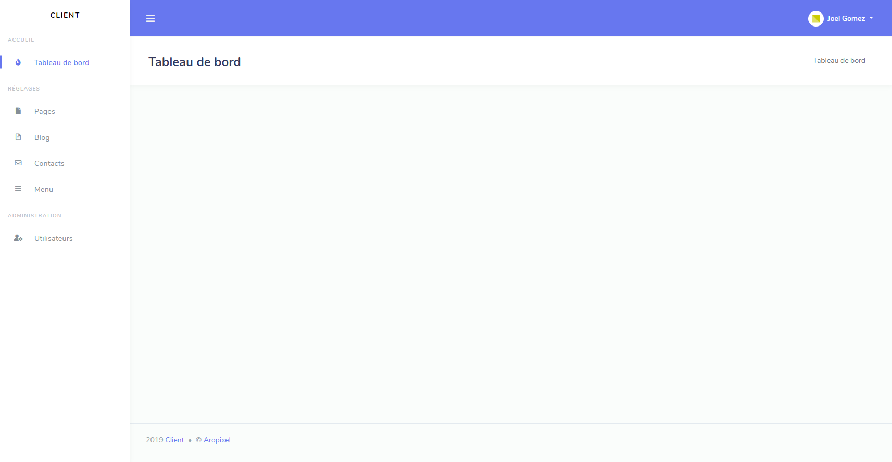

#Aropixel Admin Bundle

Aropixel Admin Bundle is a Bootstrap admin bundle for your Symfony 4/5 projects. It provides a minimalist admin system with: login, logout, admin users crud, admin menu management.
<br><br>
You can plug additional compatible bundles to manage your admin system:

- Blog content with [Aropixel Blog Bundle](https://github.com/aropixel/blog-bundle)
- The pages of your website with [Aropixel Page Bundle](https://github.com/aropixel/page-bundle)
- The menus of your website with [Aropixel Menu Bundle](https://github.com/aropixel/menu-bundle)
- Store and send incoming contacts with [Aropixel Contact Bundle](https://github.com/aropixel/contact-bundle)


[](https://github.com/stisla/stisla/issues)
[](LICENSE)



## Table of contents

- [Quick start](#quick-start)
- [License](#license)

## Quick start

- Create your Symfony project. A few more steps and you'll be good to go !

- Require Aropixel Admin Bundle: `composer require aropixel/admin-bundle`

- If you get a "knplabs/knp-paginator-bundle" error, downgrade twig to version 2:  `composer require twig/twig ^2.0` and re-install the AdminBundle

- Apply migrations

- Create a **aropixel.yaml** file in your config/packages folder and configure it according to your needs:
```yaml
aropixel_admin:
    client:
        name: "Your Client Name"
    copyright:
        name: "Aropixel"
        link: "http://www.aropixel.com"
    theme:
        menu_position: left
```

- Configure the **security.yaml** (you can copy and paste this one):
```yaml
security:

    providers:
        admin_user_provider:
            entity:
                class: Aropixel\AdminBundle\Entity\User
                property: email

    encoders:
        Aropixel\AdminBundle\Entity\User:
            algorithm: argon2i
            cost: 12

    role_hierarchy:
        ROLE_USER:        [ROLE_USER]
        ROLE_ADMIN:       [ROLE_ADMIN]
        ROLE_SUPER_ADMIN: [ROLE_ADMIN, ROLE_ALLOWED_TO_SWITCH]
        ROLE_HYPER_ADMIN: [ROLE_SUPER_ADMIN, ROLE_ALLOWED_TO_SWITCH]

    firewalls:
        backoffice:
            context: primary_auth
            pattern:            ^/admin
            form_login:
                provider:       admin_user_provider
                login_path:     aropixel_admin_security_login
                use_forward:    true
                use_referer:    true
                check_path:     aropixel_admin_security_check
                failure_path:   aropixel_admin_security_login
                default_target_path: _admin
            remember_me:
                secret:   '%kernel.secret%'
                lifetime: 2592000 # 1 month in seconds
                path:     /admin
            logout:
                path: aropixel_admin_security_logout
                target: aropixel_admin_security_login
            anonymous:    true
            guard:
                provider: admin_user_provider
                authenticators:
                    - Aropixel\AdminBundle\Security\LoginFormAuthenticator

        dev:
            pattern:  ^/(_(profiler|wdt)|css|images|js)/
            security: false

    access_control:
        - { path: ^/admin/login$, role: IS_AUTHENTICATED_ANONYMOUSLY }
        - { path: ^/admin/, role: ROLE_ADMIN }

```

- Create another **aropixel.yaml** file in config/packages/routes folder and include the routes:
```yaml
aropixel_admin:
    resource: '@AropixelAdminBundle/Resources/config/routing/aropixel.yml'
    prefix: /admin
```

- In order to manage the menu of your admin system, you now need to create a new event listener. 
This file will also be needed if you use other bundles from Aropixel.
It must be called **ConfigureMenuListener** and look like that:
```php
<?php

namespace App\EventListener;

use Aropixel\AdminBundle\Event\ConfigureMenuEvent;
use Aropixel\AdminBundle\Menu\AbstractMenuListener;

class ConfigureMenuListener extends AbstractMenuListener
{
    /**
     * @param ConfigureMenuEvent $event
     */
    public function onMenuConfigure(ConfigureMenuEvent $event)
    {
        $request = $this->requestStack->getCurrentRequest();
        $this->factory = $event->getFactory();
        $this->em = $event->getEntityManager();
        $this->routeName = $request->get('_route');
        $this->routeParameters = $request->get('_route_params');

        $this->menu = $event->getAppMenu('main');
        if (!$this->menu) {
            $this->menu = $this->createRoot();
        }

        // To add an item to the navigation bar of your admin
        // system, you'll need to indicate a name, a route
        // in your admin system and a Fontawesome class as follow :

        $this->addItem("Dashboard", "_admin", "fas fa-home");

        // You can also add some categories to put the items 
        // as it is done here for managing the users :
        
        $this->addCategory("Administration");
        $this->addItem("Users", "user_index", "fas fa-users");
        
        // Another option is to create some group items to put them
        // as one item with a dropdown :

        // $groupItem = $this->createGroupItem("Pages", "fas fa-file");
        // $this->addSubItem($groupItem, 'Homepage', ['route' => 'homepage', 'routeParameters' => ['type' => 'homepage']]);
        // $this->addSubItem($groupItem, 'Contacts', ['route' => 'contacts', 'routeParameters' => ['type' => 'contacts']]);
        // $this->addGroupItem($groupItem);

        // Do not remove this line
        $event->addAppMenu($this->menu, false, 'main');
    }
}
```
- Once your event listener created, add it to your 'services.yaml' (careful with the indentation):
```yaml
App\EventListener\ConfigureMenuListener:
    tags:
        - { name: kernel.event_listener, event: aropixel.admin_menu_configure, method: onMenuConfigure }
```

<br>

- You're all set 🎉 ! You can create your first admin access using  
`php bin/console aropixel:admin:setup` and go to the route /admin to start 
working on your project and manage your users.

<br>

Cool, but not enough ? Check the others
[Aropixel bundles](https://github.com/aropixel/) to optimise your admin system !

## License
Aropixel Admin Bundle is under the [MIT License](LICENSE)
