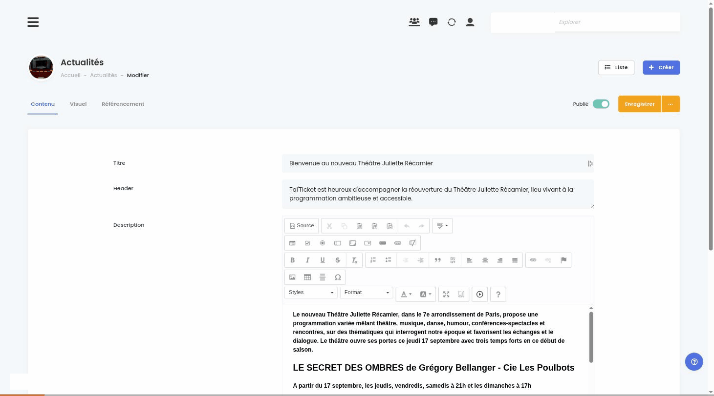

# Aropixel Admin Bundle

<div align="center">
    
</div>

## Presentation

The `AropixelAdminBundle` is a **developer-friendly, streamlined administration framework** for Symfony applications. It gives you the tools and a solid foundation to build an admin interface quickly, without getting in the way of your own code and without becoming a black box.

As a facilitator, it helps automate repetitive CRUD tasks through a custom `make:crud` generator that starts from your own `FormType`.

## See it in action

`make:crud` reads an existing `FormType` and generates a full create/read/update/delete interface around it — routes, controller, DataTable listing, form page.


## In practice: several widgets in a few lines

A concrete example rather than a feature list: a relation field (category), a boolean (toggle) and an image with upload, a shared media library and cropping — all in a single `FormType`.

The FormType:

```php
use Aropixel\AdminBundle\Form\Type\Image\Single\ImageType;
use Aropixel\AdminBundle\Form\Type\ToggleSwitchType;
use Symfony\Bridge\Doctrine\Form\Type\EntityType;

$builder
    ->add('title', TextType::class, [
        'label' => 'Title',
    ])
    ->add('category', EntityType::class, [
        'label' => 'Category',
        'class' => Category::class,
        'choice_label' => 'name',
        'required' => false,
    ])
    ->add('published', ToggleSwitchType::class, [
        'label' => 'Published',
        'required' => false,
    ])
    ->add('cover', ImageType::class, [
        'label' => 'Cover image',
        'property_path' => 'coverFilename',
        'data_value' => 'coverFilename',
        'crops_value' => 'coverCrops',
        'crops' => [
            'article_cover' => 'Cover (16/9)',
        ],
        'required' => false,
    ])
;
```

The template:

```twig
{{ form_row(form.title) }}
{{ form_row(form.category) }}
{{ form_row(form.published) }}
{{ form_row(form.cover) }}
```

The result:


That's it — no extra configuration, no JavaScript to write. The same principle applies to image galleries, files and collections. See the [full widget catalogue](doc/forms.md) for everything else: `Select2Type`, `FilterableEntityType`, `CollectionType`, `DateTimeType`, `EditorType`, `VideoType`...

## Our suite of tools

`AropixelAdminBundle` is the foundation the rest of the ecosystem builds on:

* **[PageBundle](https://github.com/aropixel/page-bundle)** — a visual, block-based page builder with pre-rendered HTML, fixed pages, and full SEO fields. A lightweight CMS alternative.

  

* **[BlogBundle](https://github.com/aropixel/blog-bundle)** — posts and categories with scheduling, SEO fields and image crops. The editorial layer for your Symfony site.

  

* **[MenuBundle](https://github.com/aropixel/menu-bundle)** — drag-and-drop navigation menus across multiple locations: header, footer, and beyond.

> [!NOTE]
> AropixelAdminBundle is optimized to work with Symfony 6/7 and PHP 8.2 and above.
> Using it with earlier versions is highly likely to cause errors or incompatibilities.

## Key Features

* **Easy Installation and Configuration**
  Seamless integration with Symfony projects and pre-configured settings that can be customized to fit specific project requirements.

* **User Management**
  Full admin user CRUD, plus role-based access control to restrict sections of the admin panel.

* **Content Management**
  Customizable administration interface for managing blog posts, news, comments and categories (via BlogBundle).

* **Page Management**
  Intuitive page editor: create, modify, move and delete pages and subpages (via PageBundle).

* **Menu Management**
  Manage header and footer navigation, with dynamic, reorderable menu links (via MenuBundle).

* **Extensibility**
  Modular architecture — each feature is encapsulated in a module, so it's easy to extend or replace. Customizable workflows to fit different projects.

* **Multi-language Support**
  Interface available in French, English, German, Spanish, Italian and Czech.

## Further documentation

### Getting Started
* [Installation](doc/installation.md)
* [Create Admin User (`aropixel:admin:create-user`)](doc/create_user.md)
* [Internationalisation (i18n)](doc/i18n.md)

### Tools & Generators
* [CRUD Generator (`make:crud`)](doc/make_crud.md)
* [DataTable Component](doc/datatable.md)
* [Select2 Component](doc/select2.md)

### Forms & Templates
* [Custom Form Types](doc/forms.md)
* [Form Templates](doc/form_templates.md)
* [Twig Macros](doc/macros.md)

### Customization
* [CSS Customization](doc/css_customization.md)
* [Entity Customization](doc/entities.md)
* [Admin Menu Customization](doc/admin_menu.md)
* [Live component catalogue](https://aropixel.github.io/admin-bundle/) — every UI component, in every state, rendered on the real bundle CSS (also served in-app at `/admin/_catalog` in the dev environment)
